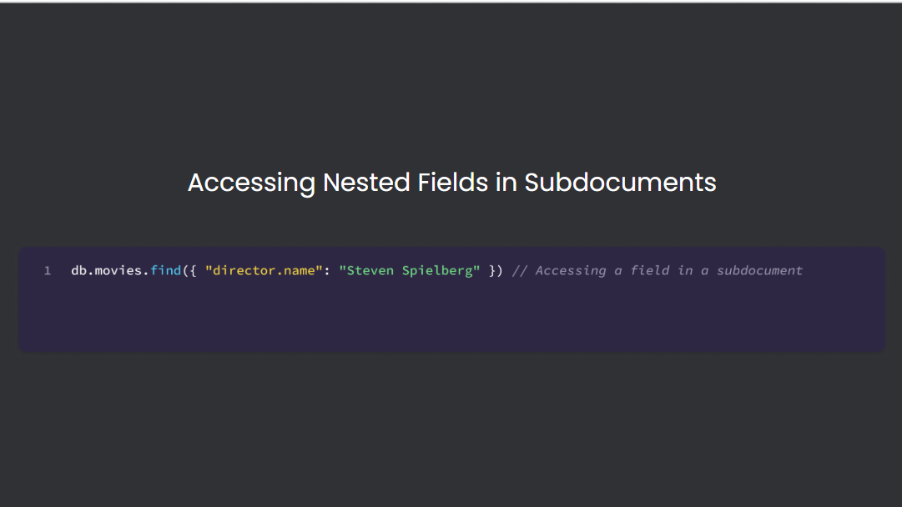
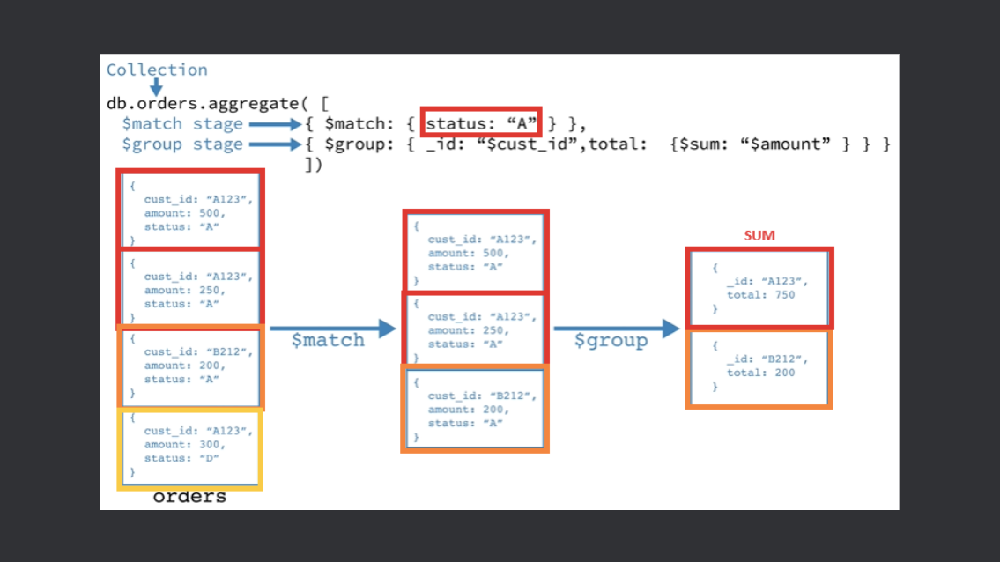
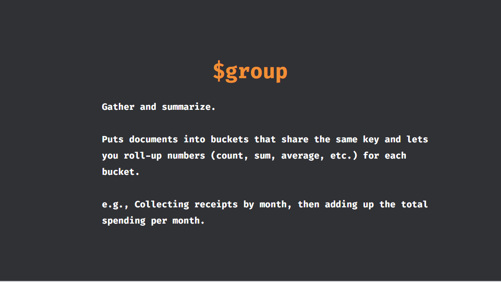

# cheat sheet

## SQL

1. INNER JOIN - Fetch Only Matching Records

    ```sql 
    SELECT customer.first_name, customer.last_name, invoice.Total
    FROM customer
    INNER JOIN invoice ON customer.customer_id = invoice.customer_id;
    ```

2. LEFT JOIN - Show All Records from One Table, Even if There’s No Match

   ```sql 
    SELECT customer.first_name, customer.last_name, invoice.total
    FROM customer
    LEFT JOIN invoice ON customer.customer_id = invoice.customer_id;
    ```
   
3. RIGHT JOIN  - Show All Records from the Second Table

    ```sql
    SELECT customer.first_name, customer.last_name, invoice.total
    FROM customer
    RIGHT JOIN invoice ON customer.customer_id = invoice.customer_id;
    ```

4. FULL OUTER JOIN - Show All Records from Both Tables

   ```sql
   SELECT customer.first_name, customer.last_name, invoice.Total 
    FROM customer 
    LEFT JOIN invoice ON customer.customer_id = invoice.customer_id 
    UNION 
    SELECT customer.first_name, customer.last_name, invoice.Total 
    FROM invoice 
    LEFT JOIN customer ON customer.customer_id = invoice.customer_id;
   ```

> ## [tech neeti chatGPT 1](https://chatgpt.com/share/68f8688f-f9e8-800e-8b65-cbe23a26e68a).

> ## [tech neeti chatGPT2](https://chatgpt.com/share/68f86d01-ee80-800e-a136-68a812f4031d).


---
---

## noSQL
  


> ## [tech neeti chatGPT1](https://chatgpt.com/share/68fed2c3-ab38-800e-baec-e6729a1e63c0)

1. find() and findOne()
   
    ```nosql
    db.collection.find(<query>, <projection>, <options>)

    db.collection.findOne( <query>, <projection>, <options>)
    ```


2. Nested Fields

    ```nosql
    db.collection.find({“root.child_1.child_1_1”: “condition”})

    db.collection.find({“location.address.city”: “California”}) 
    ```




3. Aggregation Pipeline








